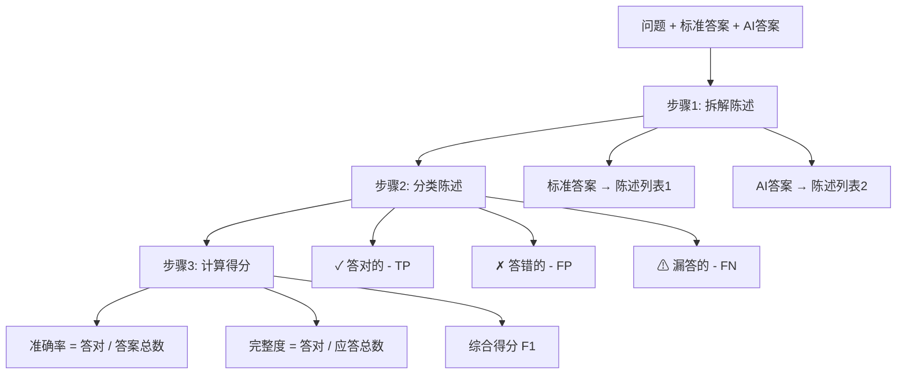

# 理解 Answer Correctness 指标 - 通俗教程

## 目录
1. [这个指标是做什么的](#这个指标是做什么的)
2. [核心思路](#核心思路)
3. [评估流程详解](#评估流程详解)
4. [实际例子](#实际例子)
5. [评分标准](#评分标准)
6. [常见问题](#常见问题)
7. [何时使用这个指标](#何时使用这个指标)

---

## 这个指标是做什么的

### 一句话解释

**Answer Correctness（答案准确性）** 用来评估"AI 系统给出的答案与标准答案相比，有多准确、多完整"。

### 日常类比

想象你在参加考试：
- **标准答案**：老师手里的参考答案（ground_truth_answer）
- **你的答案**：你写在试卷上的答案（answer）
- **这个指标**：老师批改试卷时，既要看你答对了多少，也要看你有没有答漏、有没有答错

### 适用场景

只要你的 AI 系统需要回答问题，并且你有"标准答案"可以对照，就可以用这个指标。例如：
- 客服机器人回答产品问题
- 智能问答系统回答事实性问题
- RAG 系统（检索增强生成）给出的答案

---

## 核心思路

### 三步评估法



### 关键概念

| 概念 | 含义 | 通俗理解 |
|------|------|----------|
| **陈述 (Statement)** | 一条独立的、可验证的信息 | 把长答案拆成一句句短事实 |
| **TP (答对的)** | AI答案里说对的内容 | 这部分值得得分 ✓ |
| **FP (答错的)** | AI答案里说错的内容 | 这部分要扣分 ✗ |
| **FN (漏答的)** | 标准答案有但AI没说的 | 这部分也要扣分 ⚠ |

---

## 评估流程详解

### 步骤 1: 拆解陈述

**目标**: 把完整的答案拆成一条条独立的"陈述"

#### 什么是"陈述"？

每条陈述应该：
1. **独立存在** - 不依赖上下文就能理解
2. **单一事实** - 只说一件事
3. **可验证** - 能判断对错

#### 例子

**原始答案**:
> "FHA 贷款要求 3.5% 首付，信用分数至少 580 分，还需要购买保险。"

**拆解后的陈述**:
1. "FHA 贷款要求 3.5% 首付"
2. "FHA 贷款要求信用分数至少 580 分"
3. "FHA 贷款要求购买保险"

---

### 步骤 2: 分类陈述

**目标**: 把每条陈述归类到 TP、FP 或 FN

#### 分类规则

| 类别 | 定义 | 问自己 |
|------|------|--------|
| **TP** | AI答案说的，标准答案支持 | "这条对吗？" ✓ |
| **FP** | AI答案说的，标准答案不支持 | "这条错了吗？" ✗ |
| **FN** | 标准答案有的，AI没说 | "这条漏了吗？" ⚠ |

#### 具体例子

**问题**: "FHA 贷款有什么要求？"

**标准答案陈述**:
1. "FHA 需要 3.5% 首付"
2. "FHA 需要 580 信用分数"
3. "FHA 需要购买保险"

**AI 答案陈述**:
1. "FHA 需要 3.5% 首付"
2. "FHA 需要 580 信用分数"
3. "FHA 需要 5% 首付" ← 这条是错的！

**分类结果**:
- **TP = 2**: 
  - ✓ "FHA 需要 3.5% 首付"（答对了）
  - ✓ "FHA 需要 580 信用分数"（答对了）
- **FP = 1**: 
  - ✗ "FHA 需要 5% 首付"（答错了，与标准答案矛盾）
- **FN = 1**: 
  - ⚠ "FHA 需要购买保险"（标准答案有，但 AI 没说）

---

### 步骤 3: 计算得分

#### 三个关键指标

**1. Precision (准确率) - "你说的有多少是对的"**

```
公式: Precision = TP / (TP + FP)
      = 答对的 / AI答案总数
```

**通俗理解**: 你答案的"质量"如何

**例子计算**:
```
Precision = 2 / (2 + 1) = 2/3 = 0.67 = 67%
```
→ AI 说了 3 条，其中 2 条对，1 条错，质量 67%

---

**2. Recall (完整度) - "该说的你说了多少"**

```
公式: Recall = TP / (TP + FN)
      = 答对的 / 标准答案总数
```

**通俗理解**: 你答案的"完整性"如何

**例子计算**:
```
Recall = 2 / (2 + 1) = 2/3 = 0.67 = 67%
```
→ 标准答案有 3 条，AI 只答对 2 条，完整度 67%

---

**3. F1 Score (综合得分)**

```
公式: F1 = 2 × (Precision × Recall) / (Precision + Recall)
```

**通俗理解**: 既要准确，又要完整，取个平衡

**例子计算**:
```
F1 = 2 × (0.67 × 0.67) / (0.67 + 0.67)
   = 2 × 0.4489 / 1.34
   = 0.67 = 67%
```
→ 综合评分 67 分（既有错误，也有遗漏）

---

## 实际例子

### 例子 1: 完美答案（满分）

**问题**: "FHA 贷款的最低首付是多少？"

**标准答案**: 
> "FHA 贷款要求最低 3.5% 首付。"

**AI 答案**: 
> "FHA 贷款要求最低 3.5% 首付。"

**分类**:
```
TP = 1 ✓ "FHA 贷款要求最低 3.5% 首付"
FP = 0
FN = 0

Precision = 1/1 = 1.0 (100% 准确)
Recall = 1/1 = 1.0 (100% 完整)
F1 = 1.0 → 满分！
```

**点评**: 完全正确，完全完整 👍

---

### 例子 2: 部分遗漏（扣分）

**问题**: "FHA 贷款有什么要求？"

**标准答案**: 
> "FHA 贷款要求 3.5% 首付、580 信用分数、购买保险。"

**AI 答案**: 
> "FHA 贷款要求 3.5% 首付和 580 信用分数。"

**拆解 + 分类**:

标准答案陈述：
1. "FHA 需要 3.5% 首付"
2. "FHA 需要 580 信用分数"
3. "FHA 需要购买保险"

AI 答案陈述：
1. "FHA 需要 3.5% 首付"
2. "FHA 需要 580 信用分数"

**分类**:
```
TP = 2 ✓ (首付、信用分数)
FP = 0
FN = 1 ⚠ (漏了保险)

Precision = 2/2 = 1.0 (100% 准确 - 说的都对)
Recall = 2/3 = 0.67 (67% 完整 - 漏了一条)
F1 = 2 × 1.0 × 0.67 / 1.67 = 0.80 → 80分
```

**点评**: 质量很好，但不够完整 ⚠️

---

### 例子 3: 有错误信息（扣分）

**问题**: "FHA 贷款的最低首付是多少？"

**标准答案**: 
> "FHA 贷款要求最低 3.5% 首付。"

**AI 答案**: 
> "FHA 贷款要求 5% 或 10% 首付，取决于信用分数。"

**拆解 + 分类**:

标准答案陈述：
1. "FHA 需要 3.5% 首付"

AI 答案陈述：
1. "FHA 需要 5% 首付"
2. "FHA 需要 10% 首付"

**分类**:
```
TP = 0 (没有答对的)
FP = 2 ✗ (5% 和 10% 都是错的)
FN = 1 ⚠ (漏了正确的 3.5%)

Precision = 0/2 = 0.0 (0% 准确 - 全错了)
Recall = 0/1 = 0.0 (0% 完整 - 没答对)
F1 = 0.0 → 零分！
```

**点评**: 完全错误 ✗

---

### 例子 4: 答错了 + 答对了 + 答漏了（混合情况）

**问题**: "FHA 贷款有什么要求？"

**标准答案**: 
> "FHA 需要 3.5% 首付、580 信用分数、购买保险。"

**AI 答案**: 
> "FHA 需要 3.5% 首付、580 信用分数、5% 首付。"

**拆解 + 分类**:

标准答案陈述：
1. "FHA 需要 3.5% 首付"
2. "FHA 需要 580 信用分数"
3. "FHA 需要购买保险"

AI 答案陈述：
1. "FHA 需要 3.5% 首付"
2. "FHA 需要 580 信用分数"
3. "FHA 需要 5% 首付"

**分类**:
```
TP = 2 ✓ (3.5% 首付、580 信用分数)
FP = 1 ✗ (5% 首付是错的)
FN = 1 ⚠ (漏了保险)

Precision = 2/3 = 0.67 (67% 准确)
Recall = 2/3 = 0.67 (67% 完整)
F1 = 2 × 0.67 × 0.67 / 1.34 = 0.67 → 67分
```

**点评**: 有对有错有漏，综合得分一般 ⚠️

---

### 例子 5: 回答简略但正确（高准确率，低完整度）

**问题**: "太阳如何产生能量？"

**标准答案**: 
> "太阳通过氢原子核聚变反应产生能量，释放光和热。"

**AI 答案**: 
> "太阳通过核聚变产生能量。"

**拆解 + 分类**:

标准答案陈述：
1. "太阳通过氢原子核聚变产生能量"
2. "太阳释放光和热"

AI 答案陈述：
1. "太阳通过核聚变产生能量"

**分类**:
```
TP = 1 ✓ (核聚变)
FP = 0 (没有错误)
FN = 1 ⚠ (漏了光和热)

Precision = 1/1 = 1.0 (100% 准确 - 说的都对)
Recall = 1/2 = 0.5 (50% 完整 - 说得太简略)
F1 = 2 × 1.0 × 0.5 / 1.5 = 0.67 → 67分
```

**点评**: 虽然没错，但太简略了 ⚠️

---

## 评分标准

### 得分范围

| 分数区间 | 含义 | 典型特征 |
|---------|------|----------|
| **0.9 - 1.0** | 优秀 ✓ | 几乎完美，准确且完整 |
| **0.7 - 0.9** | 良好 | 大部分正确，略有遗漏 |
| **0.5 - 0.7** | 一般 | 有明显遗漏或错误 |
| **0.3 - 0.5** | 较差 | 错误较多或遗漏严重 |
| **0.0 - 0.3** | 很差 ✗ | 基本答错或完全遗漏 |

### 不同场景的目标分数

#### 高准确性场景（医疗、法律）
目标: **F1 > 0.9**
- 不能有错误信息（FP 必须为 0）
- 重要信息不能遗漏（FN 要很低）

#### 一般问答场景（客服、知识问答）
目标: **F1 > 0.7**
- 主要信息要准确
- 允许少量细节遗漏

#### 简短摘要场景
目标: **Precision > 0.9, Recall 可低一些**
- 质量比完整性更重要
- 宁可简短，不能出错

---

## 常见问题

### Q1: 为什么不直接比较文本相似度？

**A**: 文本相似度只看"长得像不像"，不看"意思对不对"。

**例子**:
- 标准答案: "太阳由核聚变驱动"
- AI答案: "太阳由核裂变驱动"

这两句话文本很像（只差一个字），但意思完全相反！

Answer Correctness 通过拆解陈述、分类对错，能准确判断**语义层面的对错**。

---

### Q2: 如果 AI 答案比标准答案更详细会怎样？

**A**: 分两种情况：

**情况 1: 额外信息是对的**
- 这些信息无法被验证（因为标准答案没提）
- 不会被算作 TP，也不会算 FP
- 实际上会降低 Recall（因为标准答案的比例下降了）

**情况 2: 额外信息是错的**
- 会被算作 FP（答错了）
- 直接降低 Precision 和 F1

**建议**: AI 答案应该"恰到好处"，不要画蛇添足。

---

### Q3: 陈述拆分不准确怎么办？

**A**: 这个指标依赖 LLM 来拆分和分类陈述，确实存在一定误差。

**降低误差的方法**:
1. 使用更强大的 LLM（如 GPT-4）
2. 标准答案尽量清晰、结构化
3. 多次评估取平均值

**局限性**: 这是 LLM-as-Judge 方法的共同问题，目前无法完全避免。

---

### Q4: 能否调整 Precision 和 Recall 的权重？

**A**: 可以！通过调整 F-beta 参数：

```python
# 更重视完整性（宁可多说，不能漏说）
metric = AnswerCorrectness(llm_uri=uri, api_key=key, beta=2.0)

# 更重视准确性（宁可少说，不能说错）
metric = AnswerCorrectness(llm_uri=uri, api_key=key, beta=0.5)
```

详见: [理解 F1 Score - F-beta 部分](./understanding_f1_score.md#f-beta-score-可调节版本)

---

### Q5: 什么时候 F1 = 0？

**A**: 当 TP = 0 时，即"完全没答对"：

**例子**:
- 标准答案: "地球是圆的"
- AI答案: "地球是平的"

```
TP = 0 (没有答对)
FP = 1 (答错了)
FN = 1 (该说的没说对)

Precision = 0, Recall = 0, F1 = 0
```

---

## 何时使用这个指标

### ✓ 适用场景

1. **有明确标准答案的问答系统**
   - 例: 客服机器人、知识问答

2. **事实性问题（而非开放性问题）**
   - 例: "FHA 贷款要求是什么？" ✓
   - 不适合: "你觉得哪种贷款更好？" ✗

3. **需要同时评估准确性和完整性**
   - 不仅要答对，还要答全

### ✗ 不适用场景

1. **没有标准答案**
   - 开放式问题、创意写作

2. **答案形式比内容更重要**
   - 例: 代码生成（要看能否运行）

3. **主观评价类问题**
   - 例: "这部电影怎么样？"

---

## 总结

### 一句话总结

**Answer Correctness 通过拆解陈述、分类对错，综合评估 AI 答案的"准确性"和"完整性"。**

### 核心要点

1. **三步流程**: 拆解 → 分类 → 计算
2. **三个指标**: Precision（准确率）、Recall（完整度）、F1（综合分）
3. **三种陈述**: TP（答对的）、FP（答错的）、FN（漏答的）

### 记忆技巧

想象你是老师批改试卷：
- **Precision**: 学生写的答案里，有多少是对的？
- **Recall**: 标准答案的要点，学生答对了多少？
- **F1**: 综合评分，既要对，也要全

### 快速决策

| 你在乎什么 | 看哪个指标 |
|-----------|-----------|
| 不能说错 | Precision |
| 不能漏答 | Recall |
| 既要对又要全 | F1 Score |

---

## 相关文档

- [理解 F1 Score](./understanding_f1_score.md) - 深入理解 F1 计算原理
- [评估指标总览](./metrics_field_mapping.md) - 所有指标的对比
- [什么是 Zeval](./what_is_zeval.md) - 评估框架介绍
