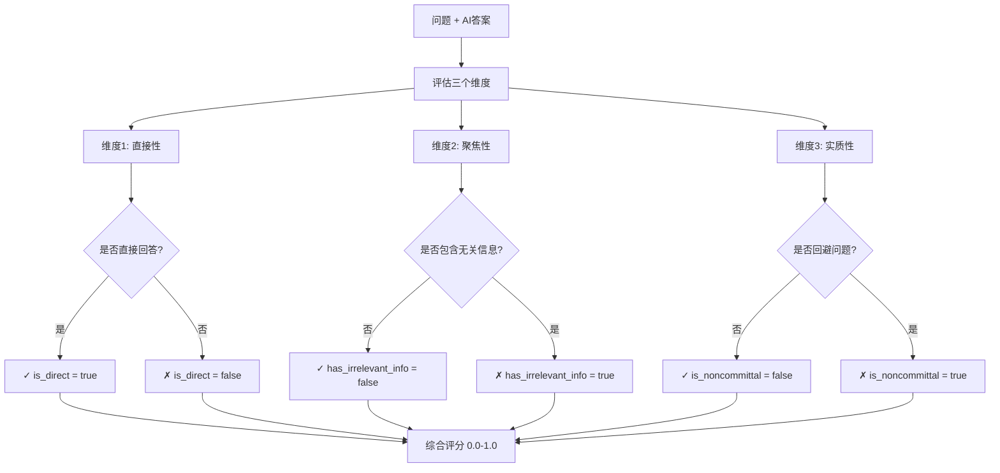
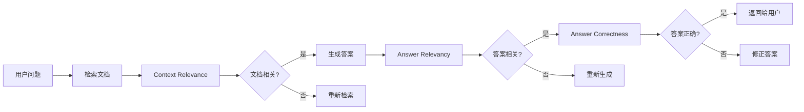

# 理解 Answer Relevancy 指标 - 通俗教程

## 目录
1. [这个指标是做什么的](#这个指标是做什么的)
2. [核心思路](#核心思路)
3. [三大评估维度](#三大评估维度)
4. [实际例子](#实际例子)
5. [评分标准](#评分标准)
6. [常见问题](#常见问题)
7. [与其他指标的区别](#与其他指标的区别)
8. [何时使用这个指标](#何时使用这个指标)

---

## 这个指标是做什么的

### 一句话解释

**Answer Relevancy（答案相关性）** 用来评估"AI 给出的答案是否真正回答了你的问题"。

### 日常类比

想象你问朋友一个问题：
- **你的问题**：现在几点了？
- **朋友回答 A**：现在下午 3 点 ✓（直接回答）
- **朋友回答 B**：我也不知道，你看看手机吧 ✗（敷衍回避）
- **朋友回答 C**：现在下午 3 点，天气真好，我昨天去了公园... ⚠️（跑题了）

Answer Relevancy 就是判断 AI 的回答属于哪种类型。

### 关键点：只看相关性，不看正确性

**重要**: 这个指标**不关心答案对不对**，只关心**答案是否回应问题**。

**例子**:
- 问题: "巴黎是哪个国家的首都？"
- 答案: "巴黎是德国的首都"
  - Answer Relevancy: **高分** ✓（直接回答了问题）
  - Answer Correctness: **低分** ✗（答案是错的）

---

## 核心思路

### 评估流程



### 关键概念

| 概念 | 含义 | 好的表现 | 差的表现 |
|------|------|---------|---------|
| **直接性 (Directness)** | 是否直接回答问题 | 开门见山 ✓ | 绕弯子、答非所问 ✗ |
| **聚焦性 (Focus)** | 是否只说相关内容 | 切中要点 ✓ | 东拉西扯、跑题 ✗ |
| **实质性 (Commitment)** | 是否给出实质回答 | 有实际内容 ✓ | 敷衍、回避、模糊 ✗ |

---

## 三大评估维度

### 维度 1: 直接性 (Directness)

#### 定义
答案是否**直接回答**了问题？

#### 好例子 ✓

**问题**: "Python 是什么？"

**直接回答**:
> "Python 是一种高级编程语言。"

✓ 直接回答了"是什么"

#### 差例子 ✗

**问题**: "Python 是什么？"

**间接回答**:
> "很多人用 Python 来做数据分析和机器学习。"

✗ 没有直接回答"是什么"，而是说"用来做什么"

---

### 维度 2: 聚焦性 (Focus)

#### 定义
答案是否**只包含相关信息**，没有跑题？

#### 好例子 ✓

**问题**: "如何重置密码？"

**聚焦回答**:
> "点击登录页面的'忘记密码'，输入邮箱，按照邮件链接重置。"

✓ 只说重置密码的步骤

#### 差例子 ✗

**问题**: "如何重置密码？"

**跑题回答**:
> "点击'忘记密码'，输入邮箱重置。顺便说一下，我们的密码系统非常安全，使用了 AES-256 加密，符合 ISO 27001 标准，服务器部署在亚马逊云..."

✗ 包含大量无关的安全技术细节

---

### 维度 3: 实质性 (Commitment)

#### 定义
答案是否**有实质内容**，而不是回避或敷衍？

#### 好例子 ✓

**问题**: "这个产品支持 Windows 吗？"

**实质回答**:
> "支持，兼容 Windows 10 及以上版本。"

✓ 给出明确答案

#### 差例子 ✗

**问题**: "这个产品支持 Windows 吗？"

**回避回答**:
> "这取决于你的具体需求和配置。"

✗ 没有给出实质性答案，模糊回避

**更差的例子**:
> "我不确定，你可以查看产品文档。"

✗ 完全回避，让用户自己找答案

---

## 实际例子

### 例子 1: 完美答案（满分）

**问题**: "FHA 贷款的最低首付是多少？"

**答案**: 
> "FHA 贷款的最低首付是 3.5%。"

**评估**:
- ✓ **直接性**: 直接回答了"是多少"
- ✓ **聚焦性**: 只说首付，没有多余信息
- ✓ **实质性**: 给出了具体数字

**得分**: **1.0**（完美）

---

### 例子 2: 有额外信息但相关（良好）

**问题**: "FHA 贷款的最低首付是多少？"

**答案**: 
> "FHA 贷款的最低首付是 3.5%，前提是你的信用分数至少 580 分。如果信用分数在 500-579 之间，则需要 10% 首付。"

**评估**:
- ✓ **直接性**: 直接回答了"3.5%"
- ⚠️ **聚焦性**: 包含额外的信用分数信息（但这些信息有相关性）
- ✓ **实质性**: 给出了实质性答案

**得分**: **0.8-0.9**（良好，有些额外信息但有用）

---

### 例子 3: 包含大量无关信息（中等）

**问题**: "FHA 贷款的最低首付是多少？"

**答案**: 
> "FHA 贷款的最低首付是 3.5%。FHA 全称是 Federal Housing Administration，成立于 1934 年，旨在帮助首次购房者。FHA 贷款的历史可以追溯到大萧条时期，当时美国房地产市场..."

**评估**:
- ✓ **直接性**: 开头直接回答了问题
- ✗ **聚焦性**: 包含大量无关的历史背景
- ✓ **实质性**: 给出了实质性答案

**得分**: **0.5-0.6**（中等，跑题严重）

---

### 例子 4: 答非所问（较差）

**问题**: "FHA 贷款的最低首付是多少？"

**答案**: 
> "FHA 贷款是一种很受欢迎的贷款类型，很多首次购房者选择它。"

**评估**:
- ✗ **直接性**: 没有回答"是多少"
- ✗ **聚焦性**: 说的是贷款特点，不是首付金额
- ⚠️ **实质性**: 虽然有内容，但不是问题要的内容

**得分**: **0.2-0.3**（较差，答非所问）

---

### 例子 5: 敷衍回避（极差）

**问题**: "FHA 贷款的最低首付是多少？"

**答案**: 
> "这取决于你的具体情况，建议咨询贷款专员。"

**评估**:
- ✗ **直接性**: 没有回答问题
- ✗ **聚焦性**: 没有提供任何相关信息
- ✗ **实质性**: 完全回避，没有实质内容

**得分**: **0.0-0.1**（极差，敷衍回避）

---

### 例子 6: 不知道坦诚告知（极差）

**问题**: "2025 年的 FHA 贷款政策有什么变化？"

**答案**: 
> "抱歉，我的知识库截止到 2023 年，无法回答 2025 年的政策变化。"

**评估**:
- ✗ **直接性**: 没有回答问题
- ✓ **聚焦性**: 没有跑题
- ✗ **实质性**: 明确表示不知道（虽然诚实，但没有实质内容）

**得分**: **0.0**（虽然诚实，但相关性为零）

**注意**: 这种诚实的"不知道"比瞎编强，但从**相关性**角度看，得分仍然很低。

---

### 例子 7: 间接但有用（中等偏上）

**问题**: "如何提高网站加载速度？"

**答案**: 
> "网站加载速度的常见瓶颈是图片过大、JS 文件太多、服务器响应慢。你可以通过压缩图片、合并 JS 文件、使用 CDN 来改善。"

**评估**:
- ⚠️ **直接性**: 先说问题再说解决方案（有点绕，但可接受）
- ✓ **聚焦性**: 全部围绕加载速度
- ✓ **实质性**: 给出了可操作的建议

**得分**: **0.7-0.8**（中等偏上，略显间接但有用）

---

## 评分标准

### 得分范围

| 分数区间 | 含义 | 典型特征 |
|---------|------|----------|
| **0.9 - 1.0** | 完美 ✓ | 直接、聚焦、实质，无任何问题 |
| **0.7 - 0.9** | 良好 | 回答了问题，可能有些额外上下文或略显间接 |
| **0.4 - 0.6** | 中等 | 部分回答问题，但包含大量无关信息或较间接 |
| **0.1 - 0.3** | 较差 | 几乎没回答问题，大部分内容无关 |
| **0.0 - 0.1** | 极差 ✗ | 完全跑题、回避、敷衍，或明确表示不知道 |

### 评分逻辑速查表

| 直接性 | 聚焦性 | 实质性 | 典型得分 | 例子 |
|-------|-------|-------|---------|------|
| ✓ | ✓ | ✓ | 0.9-1.0 | "最低首付是 3.5%" |
| ✓ | ⚠️ | ✓ | 0.7-0.9 | "最低首付是 3.5%，历史上..." |
| ✓ | ✗ | ✓ | 0.5-0.6 | "最低首付是 3.5%，以下是 FHA 的详细历史..." |
| ✗ | ✓ | ✓ | 0.5-0.7 | "很多人选择 FHA 贷款"（间接但有用） |
| ✗ | ✗ | ✓ | 0.3-0.5 | "FHA 是个好选择，很受欢迎..." |
| ✗ | ✗ | ✗ | 0.0-0.2 | "这取决于你的情况" / "我不知道" |

---

## 常见问题

### Q1: 答案很长就一定得分低吗？

**A**: 不一定！关键看内容是否相关。

**例子 1（长但相关 - 高分）**:

问题: "如何申请 FHA 贷款？"

答案: "申请 FHA 贷款的步骤：1. 准备信用报告和收入证明；2. 找到 FHA 批准的贷款机构；3. 提交贷款申请；4. 等待审批；5. 完成房屋评估；6. 签署贷款文件。整个过程通常需要 30-45 天。"

→ 虽然长，但**每句话都相关**，得分高 ✓

**例子 2（长且跑题 - 低分）**:

问题: "如何申请 FHA 贷款？"

答案: "FHA 成立于 1934 年，旨在帮助大萧条后的购房者。当时的首付要求是 20%，后来逐步降低到现在的 3.5%。FHA 的历史可以追溯到..."

→ 虽然长，但**大部分无关**，得分低 ✗

---

### Q2: 答案错了但很相关，得分会高吗？

**A**: 会！因为 Answer Relevancy **只看相关性，不看正确性**。

**例子**:

问题: "地球是什么形状？"

答案: "地球是平的。"

- **Answer Relevancy**: **1.0** ✓（直接回答了形状问题）
- **Answer Correctness**: **0.0** ✗（答案完全错误）

**建议**: 两个指标配合使用！
- Answer Relevancy 确保"答案回应了问题"
- Answer Correctness 确保"答案内容是对的"

---

### Q3: AI 说"我不知道"会得多少分？

**A**: 通常得 **0.0 分**。

**原因**:
- ✗ 没有实质性内容（is_noncommittal = true）
- ✗ 没有回答问题

**例子**:

问题: "FHA 贷款的最低首付是多少？"

答案: "我不确定，建议咨询专业人士。"

→ 得分 **0.0**（虽然诚实，但相关性为零）

**但是**: 从用户体验角度，诚实地说"不知道"比瞎编强！这时候 Answer Correctness 的价值就体现出来了：
- 瞎编的答案: Relevancy 高，Correctness 低 ✗
- 诚实"不知道": Relevancy 低，但不会误导用户 ✓

---

### Q4: 答案里包含例子或背景信息算跑题吗？

**A**: 看情况，取决于这些信息是否**帮助回答问题**。

**情况 1（有用的背景 - 不算跑题）**:

问题: "为什么 FHA 贷款首付低？"

答案: "FHA 贷款的首付要求低（3.5%），因为它是政府支持的项目，旨在帮助首次购房者和低收入家庭实现购房梦想。"

→ 背景信息**解释了原因**，有助于理解，**不算跑题** ✓

**情况 2（无用的背景 - 算跑题）**:

问题: "FHA 贷款的最低首付是多少？"

答案: "FHA 贷款的最低首付是 3.5%。FHA 成立于 1934 年，总部位于华盛顿特区..."

→ 历史和总部信息与问题**无关**，**算跑题** ✗

---

### Q5: 如何提高 Answer Relevancy 分数？

**A**: 让 AI 学会"直接、聚焦、实质"地回答问题。

**实用技巧**:

1. **在 Prompt 中明确要求**:
   ```
   请直接回答问题，不要包含无关信息。
   如果不知道答案，请明确说明，不要猜测。
   ```

2. **训练 AI 识别问题类型**:
   - 事实性问题 → 直接给答案
   - 开放性问题 → 可以展开说明

3. **后处理过滤**:
   - 检测答案是否包含问题关键词
   - 去除明显无关的段落

4. **使用检索增强 (RAG)**:
   - 确保检索到的文档与问题相关
   - 引导 AI 只使用检索到的内容

---

### Q6: Answer Relevancy 和 Context Relevance 有什么区别？

**A**: 评估的对象不同！

| 指标 | 评估对象 | 评估内容 |
|-----|---------|---------|
| **Answer Relevancy** | AI 生成的答案 | 答案是否回应问题 |
| **Context Relevance** | 检索到的上下文 | 检索的文档是否有用 |

**例子**:

问题: "FHA 贷款的最低首付是多少？"

检索到的文档: "FHA 贷款的历史可以追溯到 1934 年..."
→ **Context Relevance**: 低 ✗（检索错了，文档无关）

AI 答案: "FHA 贷款成立于 1934 年"
→ **Answer Relevancy**: 低 ✗（答非所问）
→ **Answer Correctness**: 无法评估（因为没有标准答案对比）

**正常流程应该是**:
1. **Context Relevance** 确保检索到的文档有用
2. **Answer Relevancy** 确保 AI 回答了问题
3. **Answer Correctness** 确保答案内容正确

---

## 与其他指标的区别

### Answer Relevancy vs. Answer Correctness

| 维度 | Answer Relevancy | Answer Correctness |
|-----|-----------------|-------------------|
| **评估什么** | 答案是否回应问题 | 答案内容是否正确 |
| **需要标准答案吗** | 不需要 | 需要 |
| **关心对错吗** | 不关心 | 关心 |
| **典型用途** | 检测答非所问、回避 | 检测事实错误 |

**例子对比**:

问题: "巴黎是哪个国家的首都？"

| 答案 | Relevancy | Correctness |
|-----|-----------|-------------|
| "巴黎是法国的首都" | 1.0 ✓ | 1.0 ✓ |
| "巴黎是德国的首都" | 1.0 ✓ | 0.0 ✗ |
| "巴黎是欧洲著名城市" | 0.3 ✗ | 无法评估 |
| "我不知道" | 0.0 ✗ | 0.0 ✗ |

---

### Answer Relevancy vs. Context Relevance

| 维度 | Answer Relevancy | Context Relevance |
|-----|-----------------|-------------------|
| **评估对象** | AI 生成的答案 | 检索到的文档/上下文 |
| **评估时机** | 答案生成后 | 答案生成前 |
| **目标** | 确保 AI 回答了问题 | 确保检索到有用信息 |

**RAG 系统的完整评估链**:



---

## 何时使用这个指标

### ✓ 适用场景

1. **任何问答系统**
   - 客服机器人、智能助手、RAG 系统
   - 不需要标准答案，只需要问题和答案

2. **检测答非所问**
   - AI 是否理解了问题
   - AI 是否真正回答了问题

3. **检测回避和敷衍**
   - "我不知道"
   - "这取决于情况"
   - "请查看文档"

4. **检测无关信息**
   - AI 是否跑题
   - 答案是否包含太多无关内容

### ✗ 不适用场景

1. **需要评估答案正确性**
   - 用 **Answer Correctness** 代替

2. **需要评估检索质量**
   - 用 **Context Relevance** 代替

3. **开放式创意任务**
   - 例: "写一首诗"
   - 这类任务没有明确的"相关/不相关"边界

---

## 总结

### 一句话总结

**Answer Relevancy 通过评估"直接性、聚焦性、实质性"，判断 AI 答案是否真正回应了问题。**

### 核心要点

1. **三个维度**: 直接性（是否直接回答）、聚焦性（是否跑题）、实质性（是否回避）
2. **只看相关性，不看正确性**: 答错了但回答了问题，得分也高
3. **适用所有问答场景**: 不需要标准答案，只需要问题和答案
4. **配合其他指标使用**: Relevancy + Correctness = 完整评估

### 记忆技巧

想象你在面试时被问了一个问题：
- **直接性**: 你是否直接回答了问题，而不是绕弯子？
- **聚焦性**: 你的回答是否切中要点，而不是东拉西扯？
- **实质性**: 你是否给出了实质性答案，而不是"这取决于情况"？

### 快速决策

| 你在乎什么 | 用哪个指标 |
|-----------|-----------|
| AI 是否理解问题 | Answer Relevancy |
| AI 答案是否正确 | Answer Correctness |
| 检索的文档是否有用 | Context Relevance |
| 完整评估 RAG 系统 | 三个指标都用 |

---

## 相关文档

- [理解 Answer Correctness](./understanding_answer_correctness.md) - 答案准确性指标
- [理解 Context Relevance](./understanding_context_relevance.md) - 上下文相关性指标
- [理解 F1 Score](./understanding_f1_score.md) - F1 计算原理
- [评估指标总览](./metrics_field_mapping.md) - 所有指标的对比
